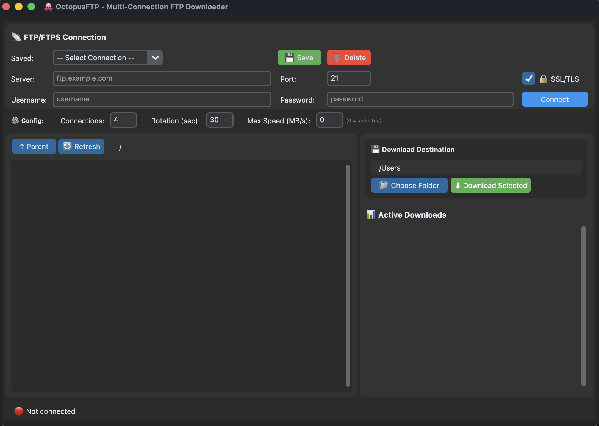

# 🐙 OctopusFTP


> 📝 **Transparency Note**: This README and the code documentation was generated with [Claude Code](https://claude.com/claude-code)

A high-performance multi-connection FTP/FTPS downloader with graphical interface.

## 📸 Screenshot



*Modern dark-themed interface with real-time bandwidth graphs, multi-connection downloads, and file integrity verification*

## ✨ Features

### Core Capabilities
- **Multi-Connection Downloads**: Download files using multiple parallel connections for maximum speed
- **Connection Rotation**: Automatically rotates connections at configurable intervals to avoid timeouts and throttling
- **FTP & FTPS Support**: Full support for both standard FTP and secure FTPS (FTP over SSL/TLS)
- **SSL Session Reuse**: Properly handles FTPS servers that require SSL session reuse
- **Recursive Directory Download**: Download entire directories with preserved folder structure
- **Pause/Resume**: Pause and resume downloads at any time
- **Real-time Progress Tracking**: Monitor download speed, progress, and ETA for each file

### User Interface
- **Modern Dark Theme**: Clean, modern interface built with CustomTkinter
- **Connection Presets**: Save and manage multiple FTP server connections
- **File Browser**: Navigate remote FTP directories with an intuitive interface
- **Download Queue**: Manage multiple simultaneous downloads with individual controls
- **Live Statistics**: Real-time display of download speed, progress, and active connections

### Advanced Features
- **Configurable Connections**: Adjust the number of parallel connections (1-16)
- **Custom Rotation Interval**: Set connection rotation timing (recommended: 30 seconds)
- **Speed Limiting**: Set maximum download speed (MB/s) to control bandwidth usage
- **Real-time Bandwidth Graphs**: Visual representation of download speed over time
- **File Integrity Verification**: Automatic checksum calculation (SHA-256) after download
- **Automatic Directory Creation**: Preserves folder structure in downloads
- **Cross-Platform**: Works on Windows, macOS, and Linux

## 🚀 Quick Start

### Download Pre-Built Releases

The easiest way to get started is to download the latest release for your platform:

**👉 [Download v0.8 Beta](https://github.com/arnaultpascual/OctopusFTP/releases)**

#### Windows
1. Download `OctopusFTP-Windows.exe`
2. Run the executable (no installation required)
3. **Note**: Windows may show a security warning - click "More info" → "Run anyway"

#### macOS
1. Download `OctopusFTP-macOS.app.zip`
2. Extract and move `OctopusFTP.app` to your Applications folder
3. **First run**: Right-click → Open (to bypass security warning)
4. **Note**: The app is unsigned, so you'll need to allow it in System Preferences

#### Linux
1. Download `OctopusFTP-Linux.tar.gz` or run from source (see below)
2. Extract: `tar -xzf OctopusFTP-Linux.tar.gz`
3. Run: `./OctopusFTP` or `python3 main.py`

### Run from Source

If you prefer to run from source or the pre-built version doesn't work on your system:

**Prerequisites**:
- Python 3.8 or higher
- matplotlib (for bandwidth graphs)

1. **Clone the repository**
   ```bash
   git clone https://github.com/arnaultpascual/OctopusFTP.git
   cd OctopusFTP
   ```

2. **Install dependencies**
   ```bash
   pip install -r requirements.txt
   ```
   Or manually:
   ```bash
   pip install matplotlib
   ```

3. **Run the application**

   **On Windows:**
   ```cmd
   run.bat
   ```

   **On macOS/Linux:**
   ```bash
   chmod +x run.sh
   ./run.sh
   ```

   Or directly with Python:
   ```bash
   python3 main.py
   ```

**macOS Note**: If you encounter Tkinter issues, install Python with Tkinter support:
```bash
brew install python-tk@3.12
```

## 📖 Usage Guide

### 1. Connect to FTP Server

1. Enter your FTP server details:
   - **Server**: FTP server hostname (e.g., `ftp.example.com`)
   - **Port**: FTP port (default: 21)
   - **Username**: Your FTP username
   - **Password**: Your FTP password
   - **SSL/TLS**: Enable for FTPS connections

2. Click **Connect**

3. **Optional**: Save the connection for future use with the **Save** button

### 2. Browse Files

- Navigate through remote directories by double-clicking folders
- Use the **↑ Parent** button to go up one level
- Use the **🔄 Refresh** button to reload the current directory

### 3. Download Files

1. Select files or folders by clicking on them (they will turn blue)
2. Choose your download destination with **📁 Choose Folder**
3. Configure download settings:
   - **Connections**: Number of parallel connections (4 recommended)
   - **Rotation**: Connection rotation interval in seconds (30 recommended)
   - **Max Speed**: Maximum download speed in MB/s (0 = unlimited)
4. Click **⬇ Download Selected**

### 4. Manage Downloads

Each active download shows:
- Progress percentage and size
- Download speed (MB/s)
- Active connections count
- Elapsed time and ETA
- **Real-time bandwidth graph**: Visual chart showing speed over the last 60 seconds
- **File checksum**: SHA-256 hash calculated automatically after download completes

Controls for each download:
- **⏸ Pause / ▶ Resume**: Pause and resume the download
- **⏹ Stop**: Cancel the download
- **🗑 Clear**: Remove completed/stopped downloads from the list

## 🔧 Configuration

### Connection Settings

**Number of Connections**:
- Range: 1-16 connections
- Recommended: 4-8 for most servers
- Higher values may trigger rate limiting on some servers

**Rotation Interval**:
- Range: 10-300 seconds
- Recommended: 30 seconds
- Prevents connection timeouts and can help avoid bandwidth throttling

**Maximum Speed (Speed Limiting)**:
- Range: 0 (unlimited) to any positive number (MB/s)
- Default: 0 (unlimited)
- Purpose: Control bandwidth usage, prevent network congestion
- Example: Set to 5 to limit total download speed to 5 MB/s
- Note: Speed is distributed equally across all connections

### Saved Connections

Connection presets are stored in `~/.octopusftp/connections.json`

**Security Note**: Passwords are stored in plain text if you choose to save them. Only use this feature on secure, personal computers.

## 🛠 Technical Details

### Architecture

**Core Components**:
- `ftp_engine.py`: Multi-threaded FTP download engine with connection rotation and speed limiting
- `ftp_gui.py`: CustomTkinter-based graphical interface
- `bandwidth_chart.py`: Real-time bandwidth visualization using matplotlib
- `main.py`: Application entry point

### How Multi-Connection Downloads Work

1. **File Splitting**: The remote file is divided into equal chunks based on the number of connections
2. **Parallel Download**: Each chunk is downloaded by a separate thread with its own FTP connection
3. **Connection Rotation**: Every N seconds (configurable), connections are closed and reopened to:
   - Avoid server-side timeouts
   - Prevent bandwidth throttling
   - Appear as natural usage patterns
4. **Chunk Reassembly**: Once all chunks are complete, they're assembled into the final file

### SSL/TLS Session Reuse

Many FTPS servers require SSL session reuse for security. OctopusFTP implements a custom `SessionReuseFTP_TLS` class that:
- Extracts the SSL session from the control connection
- Applies it to all data connections
- Prevents "TLS session reuse required" errors

### Passive Mode

OctopusFTP uses passive mode (PASV) by default, which works better with:
- NAT/firewall configurations
- Cloud FTP servers
- Most modern server setups

## 🏗 Building from Source (For Developers)

Want to build your own executables? See the detailed [Build Instructions](build_scripts/build_instructions.md) for:
- Creating Windows executables (`.exe`)
- Creating macOS applications (`.app`)
- Creating Linux binaries
- Code signing and distribution
- Troubleshooting build issues

## 🐛 Troubleshooting

### Common Issues

**Connection timeouts**
- Try reducing the number of parallel connections
- Increase the rotation interval
- Check your network/firewall settings

**"Permission denied" errors**
- Verify your FTP credentials
- Check that you have read permissions on the remote files
- Ensure the remote path exists

**macOS: "Python not found" or Tkinter errors**
- Install Python with Tkinter: `brew install python-tk@3.12`
- Or use the build script to create a standalone app

## 📋 Requirements

### Runtime Requirements
- Python 3.8+
- matplotlib 3.5.0+ (for bandwidth graphs)
- Included CustomTkinter library (bundled in `lib/` directory)

### Development/Build Requirements
- PyInstaller 5.0+ (for building executables)
- Pillow (for icon creation during build)

## 🤝 Contributing

Contributions are welcome! Here's how you can help:

1. **Report Bugs**: Open an issue with detailed information
2. **Suggest Features**: Describe your idea in an issue
3. **Submit Pull Requests**:
   - Fork the repository
   - Create a feature branch
   - Make your changes
   - Add comments to complex code sections
   - Test thoroughly
   - Submit a PR with a clear description

### Code Style
- Add type hints to function signatures
- Comment complex algorithms
- Write descriptive commit messages

## 📄 License

This project is licensed under the MIT License - see the [LICENSE](LICENSE) file for details.

## 🙏 Acknowledgments

- Built with [CustomTkinter](https://github.com/TomSchimansky/CustomTkinter) by Tom Schimansky
- Thanks to all contributors and users

## 📞 Support

- **Issues**: [GitHub Issues](https://github.com/arnaultpascual/OctopusFTP/issues)

## 🗺 Roadmap

### ✅ Completed Features
- [x] Speed limiting options
- [x] Bandwidth graphs
- [x] File integrity verification (checksums)

### 🔮 Planned Features
- [ ] Upload functionality
- [ ] SFTP support (SSH File Transfer Protocol)
- [ ] Proxy support
- [ ] Download scheduling
- [ ] Browser integration
- [ ] Multi-language support

---

**Made with 🐙 by the OctopusFTP team**

If you find OctopusFTP useful, please consider giving it a ⭐ on GitHub!
